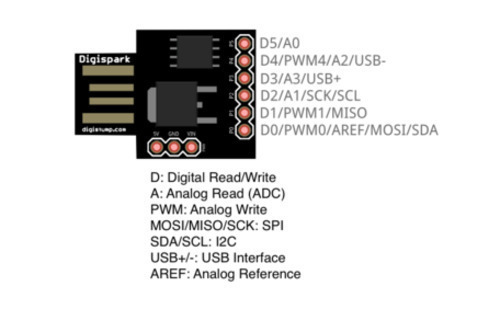

# The cheapest rubber ducky
## And how I changed its keyboard layout

Some time ago I wanted to buy a [Rubber
Ducky](https://shop.hak5.org/products/usb-rubber-ducky-deluxe), but the price
($49.99 while I’m writing this article) was too high for what I wanted to
spend.
Surfing the internet I found an alternative to the Rubber Ducky: the
**Digispark from Digistump.**



It’s a tiny development board based on the **tiny85** chip (same chip family
used on Arduino).

It’s less powerful but (much) cheaper, you can consider this digispark board
as micro Arduino board with very basic features.

Those are the main differences between the two peripherals:
 
|RUBBER DUCKY    |DIGISPARK  |
|----------------|-----------|
|32-bit set      |8-bit set  |
|60 Mhz          |16 Mhz     |
|SD card: yes    |SD card: no| 
|512 KB Flash    |8 KB Flash |

### Pretending to be a keyboard

Both Rubber Ducky and Digispark can work the same way: they are recognized by
the computer as an **HID** (Human Interface Device) and act just like a normal
keyboard would.

So the idea is to act like a keyboard, but typing faster than a human can do.

Using one or the other doesn’t make much difference, it will write much faster
than you, so much that it is sometimes invisible.


### My problem with Digispark

As there are a lot of tutorials on the internet about [how to set up the
Digispark](http://letmegooglethat.com/?q=how+to+set+up+digispark) and make
this tiny board work with Arduino IDE, I’ll jump to my problem: **the
Digistump library only allows US keyboard layout.**

That’s not a big problem if you only use standard numbers and letters, but
_it’s impossible to use symbols._ I needed an Italian keyboard layout to let
the board write on Italian computers 🇮🇹

### The solution

After a couple of hours trying to match the keystrokes to the different
keyboard layouts, I decided to do some researches, finding something
interesting on [www.usb.org](http://www.usb.org): a pdf containing all the [
**HID Usage
Tables**](https://www.usb.org/sites/default/files/documents/hut1_12v2.pdf)
(you will be astonished by how many things you could do with a Digispark and
this document)

If you search in the [Digispark
library](https://github.com/digistump/DigistumpArduino) you will find a file
named
[**DigiKeyboard.h**](https://github.com/digistump/DigistumpArduino/blob/master/digistump-
avr/libraries/DigisparkKeyboard/DigiKeyboard.h) and analyzing it, you
will notice something similar to the pdf mentioned above: **keyboard scan
codes.**

On **page 53** of this document, you can find the table containing the Hex
code for each key on your keyboard (and some more cool functions that most
keyboards do not have).

That said, it was easy to bring a solution to my problem, swapping keys and
scan codes, matching my keyboard layout.
I then forked the Digistump repo and made an [Italian version of
it](https://github.com/GiacintoCarlucci/DigistumpArduino), ready to use for
whoever needs that keyboard layout.

### A little example

If you want a little demonstration of what a Digispark can do (and trust me
when I say _little_ ), here you are a script that you can write on Arduino IDE
to create a text file on Windows computers:

```
//create a text file on desktop with a message

#include "DigiKeyboard_It.h"  
#define D 200  
void setup() {
}
void loop() {
  DigiKeyboardIt.sendKeyStroke(0);
  DigiKeyboard.delay(D);
  DigiKeyboardIt.sendKeyStroke(KEY_R, MOD_GUI_LEFT);
  DigiKeyboard.delay(D);
  DigiKeyboardIt.print("cmd -k cd %User%");
  DigiKeyboardIt.sendKeyStroke(KEY_ENTER);
  DigiKeyboard.delay(D);
  DigiKeyboardIt.print("cd Desktop");
  DigiKeyboardIt.sendKeyStroke(KEY_ENTER);
  DigiKeyboard.delay(D);
  DigiKeyboardIt.print("echo Ciao! > Aprimi.txt");
  DigiKeyboardIt.sendKeyStroke(KEY_ENTER);
  DigiKeyboard.delay(D);
  DigiKeyboardIt.print("exit");
  DigiKeyboardIt.sendKeyStroke(KEY_ENTER);
  DigiKeyboard.delay(D);
  for (;;) { } 
}
```

### Conclusion

Well, now you know that you can practice with a Digispark before buying a
faster device such as Rubber Ducky!

