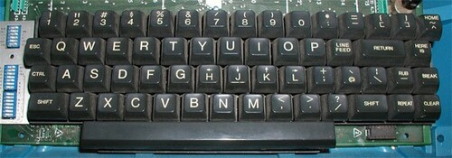

# Stop quitting Vim!
## Read this instead of mistakely open vim and find yourself on StackOverflow.

As you could try vim you would just notice how much different it is from
standard text editors.

 _So why should i bother learning vim?_

### Vim is Universal

For those of you using a unix based os: vi or vim is **installed by default**
on pretty much every unix-like operating systems (Linux, MacOSX, and BSD) so
you already have it by standard. On many restricted linux distros, vim is the
only text editor available. So if you are a programmer it makes a lot of sense
to have at least a bit o familiarity with vim.

### Vim is Powerful

Why should you really dive into vim and go beyond the standard editing of
files though? vim can be such a powerful tool if you live in the text editor,
allowing you to fly between files and editing large chuncks of text with very
few keystrokes.

Vim is highly configurable and it has an extensive plugin system, there are
lots of good plugins out there which enhance its functionality.

### Also, Vim is strange

The first thing you may notice in vim is that it is not like any other text
editor, there are a lot of users that mistakely open vim and can’t figure out
how to quit.

Another strange thing about vim is that it uses `hjkl` keys to move in the
document. Why?

Because the [creator of vi](https://en.wikipedia.org/wiki/Bill_Joy) was using
these old school terminals, that didn’t have arrow keys.

It may seem like a super hard thing to learn but trust me, all the work will
pay you after, with blazing fast document edits and powerful ways to do it,
you will use vim forever.

> The more you get into vim, the more is difficult to use other editors

### What’s the best way to learn vim?

There are many ways to start learning vim, a cool way to give it a try is to
visit vim-adventures website:

[Learn VIM while playing a game - VIM Adventures](https://vim-adventures.com)

You can also take a look to the **references** at the bottom of this document
😃

However the most common way to learn the basics is `vimtutor`, you can launch
it in the terminal if you have vim installed.

### Some commands

####  **Quit vim:**

`:quit`, `:exit`, `:q`, `:X`  
or `:q!`to exit without saving changes  
or `:wq` to write changes and quit vim

you can also exit vim typing two capital Z in the normal mode: `ZZ`

#### NORMAL MODE?

vim has several modes: normal is to navigate, delete copy and paste text. This
is the mode you should be in most of the time.

`gg` gets you to the first line of the document, while `G` gets you to the
very last line of it. If you type `2G` it will bring you to the second line of
the document.

`0` brings you to the first character of the current line

`x` will delete the current character on your cursor

`2x` will delete 2 caharacters starting from the current position of the
cursor

`u` will undo the changes

`dw` will delete the current word

`dd` will delete a line, `10dd` will delete 10 lines

`d$` deletes starting from the current cursor to the end of the line, same
with `D`

`y` is the yank command (copy command), if you type `yw` it will copy the
current word

`yy` yanks (copy) an entire line

`p` works as paste for the last deleted lines and for yank command

`r` is used for replacing a single char (useful for mispelled words), if you
type `ra` this command will replace the char on wich the cursor is with the
letter ‘a’

`c` is the change command, it will put you in insert mode automatically, if
you type `ce` it will delete characters till the end of the current word and
put you in insert mode, if you type `c$` it will delete the whole line and put
you in insert mode, you cold have the same behaviour by typing `C`

`w` will bring you forward one word at time, `3w` will bring you forward by 3
words

`b` brings you to the first char of the previous word, `3b` brings you back by
3 words and puts the cursor on the first char of the word

`f` is the forward command, it brings you forward to the char indicated, so if
you type `ft` it will bring you to the first ‘t’ char it encounters starting
from the local position of the cursor

`F` is the same as `f` but it moves backwards

`t` moves the cursor forward until the char indicated by you, if you type `tt`
and you are on a word like ‘capital’ and the cursor is on ‘c’ letter: **_c_**
apital, the cursor will be positionated on the word before ‘t’ indicated by
you: cap **_i_** tal

`T` is the same as `t` but it moves backwards

`%` puts the cursor to the first parenthesis found starting from current
cursor position

`/` is used for searching, if you type `/Dog` and hit ENTER it will bring your
cursor to the first char of the result found in the document, if you type `n`
it will bring you to the next instance of the results found for the keyword
‘Dog’. `N` searches in reverse.

`:%s/Dog/Cat` will substitute all the instances in the of ‘Dog’ with ‘Cat’

`:3,9s/Dog/Cat` will substitute the instances of ‘Dog’ with ‘Cat’ on lines 3
and 9 (so you just need to indicate lines separated by a comma)

`:%s/Dog/Cat/gc` will ask for confirmation before replacing every found
instance

#### INSERT MODE:

just type `i` while in normal mode to enter in insert mode, so you can type
what you want. To go back to normal mode just hit the **ESC** key

`a` puts you in insert mode one position after the cursor

`A` puts you in insert mode appending, putting you on the first char after the
end of the line

`s` deletes the char currently on the cursor and puts you in insert mode

`S` deletes the current line and puts you in insert mode

`o` creates a new succeding line and puts you in insert mode

`O` creates a new preceding line and enters insert mode

#### VISUAL MODE:

Select blocks of text to quick copy, delete, move parts of text, you can enter
in visual mode by pressing `v` while you are in normal mode, to exit just hit
**ESC** key

#### EXTRA COMMANDS:

  * in normal mode, if you want to know what commands starting with ‘w’ can you type, just type `:w` and then hit CTRL + D, this will give you all the possibile commands starting with ‘w’

  * you can run shell / bash commands directly in vim without exiting the editor by typing `:!<command>` so for example `:!pwd` will print out the current directory path. to go back to the editor just press ENTER
  * you can create macros to automate frequent and boring tasks

### Cheatsheets?

There are a lot of cheatsheets about vim, the most updated is
[this](https://vim.rtorr.com/). On DuckDuckGo if you search for ‘vim
cheatsheet’ it will give you a nice page full of commands:

If you want a printable reference card make sure to take a look at
[this](http://tnerual.eriogerg.free.fr/vimqrc.pdf) resource.

### Conclusion

As you might have understood, vim is a powerful tool that every developer
might at least try to gain a bit of familiarity with.

Have a look at the references if you want to dive deeper with vim, and let me
know if this article was helpful!

#### REFERENCES:

  * [The Vim Tutorial — Part One — Basic Commands](https://www.youtube.com/watch?v=ER5JYFKkYDg)
  * [The Vim Tutorial — Part Two — More Commands](https://www.youtube.com/watch?v=tExTz7GnpdQ)
  * [The VI (VIM) Text Editor](http://teaching.idallen.com/cst8207/19w/notes/300_vi_text_editor.html)
  * [Seven habits of effective text editing](https://www.moolenaar.net/habits.html)
  * [10 Reasons Why You Should Use Vi/Vim Text Editor in Linux](https://www.tecmint.com/reasons-to-learn-vi-vim-editor-in-linux/)
  * [Learn vim For the Last Time: A Tutorial and Primer](https://danielmiessler.com/study/vim/)

