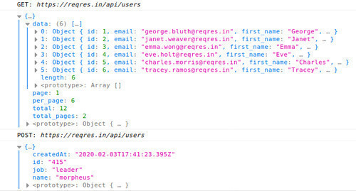

# The XMLHttpRequest Definitive guide
## Stop searching and read this

First of all, let’s understand what we are going to talk about.

### What it is

Invented by Microsoft in the early ’90s and abbreviated as **XHR** , **_X_** _ML_ **_H_** _ttp_ **_R_** _equest_ is a set of APIs that can be used by Web
browser scripting languages, such as **JavaScript** to transfer data **to**
and **from** a **Web server** using HTTP.

XHR can be used with protocols other than HTTP and data can be in the form of
not only **XML** , but also **JSON** , **HTML** or **plain text**.

### What you can do with XHR

All modern browsers have a built-in XMLHttpRequest object to request data from
a server. With an XHR object you can:

  *  **Update** a web page without reloading the page
  *  **Request** data from a server — after the page has loaded
  *  **Receive** data from a server — after the page has loaded
  *  **Send** data to a server — in the background

### What we are going to do

We are going to use a fake online REST API for testing and prototyping like
[reqres](https://reqres.in/) (another good one is
[JSONPlaceholder](https://jsonplaceholder.typicode.com/)), those are great for
tutorials, testing and code examples. In this post you will learn:

  * how to receive data with GET requests and how to send with POST
  * What is a callback and what is a promise (briefly)
  * Improve our code to make it more versatile
  * Handle request errors
  * Visualize the received data

### Receiving data

We need to **create a new xhr object** by instantiating XMLHttpRequest:

`const xhr = new XMLHttpRequest();`

this is a built-in constructor function in your browser, so you don’t need to
add any special library or package.

int the next step we need to **prepare the HttpRequest to be sent** , using a
function that takes two arguments:  
1) HTTP Method used  
2) URL to which you want to send that request

`xhr.open('GET', 'https:reqres.in/api/users')`

Now we can **send our preconfigured request** :

`xhr.send();`

This theoretically _should_ be all we need to do, infact the request is sent
to the URL using GET method and we are able to receive the response, but we
are not there yet. We need to use the response.

 **Little preamble here  
** There are two main ways to actually listen to the onload event in our xhr
request, wich are:

`/*1*/ xhr.addEventListener("load", reqListener);`

`/*2*/ xhr.onload = () => { };`

We are going to use the second one as it has a broader browser support.

So the onload function will trigger when we receive a response, in order to
get the data, we could log the response in this way:

`xhr.onload = () => { console.log(xhr.response); };`

in this case will see in the console log a bunch of data printed like a
string, but it’s actually a JSON response. To convert this response in a
Javascript object, in order to manipulate it, we can parse it:

```   
xhr.onload = () => {  
    const data = JSON.parse(xhr.response);  
	console.log(data);  
};
```

Another way to parse the JSON response is to set the responseType attribute to
‘json’:

```
xhr.responseType = 'json';


xhr.onload = () => {  
    const data = xhr.response;  
    console.log(data);  
};
```

Our code should look like this:

```
const xhr = new XMLHttpRequest();  
xhr.open('GET','https://reqres.in/api/users');  
xhr.responseType = 'json';  
xhr.onload = () => {  
    const data = xhr.response;  
    console.log(data);  
};  
xhr.send();
```

### Sending data

Let’s say that we want to crate a new user, we would need to send data in
order to specify the name and the job of the new user.

The only thing that changes is the xhr.open() call, as we need to modify our
request method to POST, set the URL for the request and **add the data** for
the user we want to create:

``` 
xhr.open('POST','https://reqres.in/api/users',{  
    "name":"morpheus",  
    "job":"leader"  
});
```

reqres.in will respond to our request with a 2xx status and sending us extra
information about our successful user creation, with a response object like
this:

```
createdAt: "2020-02-03T17:10:31.110Z"  
​id: "644"
```

### What is a callback

>  **Simply put:** _A callback is a function that is to be executed_ **
> _after_** _another function has finished executing — hence the name ‘call
> back’_.

— [Brandon Morelli](https://medium.com/u/e9031892baf5) in this beautiful
[article](https://codeburst.io/javascript-what-the-heck-is-a-callback-
aba4da2deced) about callbacks.

### What is a promise

 _(Promises only work natively in modern browsers)  
_ Promise-based XHR may help you avoid deeply nested callbacks and allowing
**method chain using .then()** Here’s what a **traditional callback model** might look like:

```
first(a,function(b){  
    second(b,function(c){  
        third(c,function(d){  
            fourth(d);  
        });  
    });  
});
```

And what that might look like using a **Promise-based approach:**

```
first(a)  
    .then(function(b){  
        return second(b);  
    })  
    .then(function(c){  
        return third(c);  
    })  
    .then(function(d){  
        return fourth(d);  
    })  
    .catch(function (error){  
        // error at any point of the chain  
    });
```

pretty clearer, uh?

### Let’s improve some code

Okay, now that we understood the basics it’s time to make the things more
professional by creating a function to receive/send data through HttpRequests:

```
const sendHttpRequest = ( method , url ) => {  
    const xhr = new XMLHttpRequest();  
    xhr.open( method , url );  
    xhr.responseType = 'json';  
    xhr.onload = () => {  
        const data = xhr.response;  
        console.log(data);  
    };  
    xhr.send();  
};
```

Not there yet. Let’s add **promises:**

```
const sendHttpRequest = (method, url) => {  
    //Adding promise  
    const promise = new Promise((resolve, reject) = > {
        const xhr = new XMLHttpRequest();  
        xhr.open(method,url);  
        xhr.responseType = 'json';  
        xhr.onload = () = > {  
            resolve(xhr.response);  
        };  
        xhr.send();  
    });  
    //returning the promise  
    return promise  
};


 //Using .then() to retrieve data
 const getData = () => {  
    sendHttpRequest('GET','https://reqres.in/api/users')  
    .then(responseData = > {  
        console.log(responseData);  
    });  
};
```

We can send POST requests as well, but some changes to sendHttpRequest must be
done:

```
 //adding data parameter
 const sendHttpRequest = (method, url, data ) => {  
    const promise = new Promise((resolve, reject) => {  
        const xhr = new XMLHttpRequest();  
        xhr.open(method,url);  
        xhr.responseType = 'json';  
        //signals that we are appending json data in POST  
        if (data){  
            xhr.setRequestHeader('Content-Type','application/json');  
        }          
        xhr.onload = () => {  
            resolve(xhr.response);  
        };  
        //appending json data  
        xhr.send(JSON.stringify(data));
    });  
    return promise  
};


 //Sending POST request
 const sendData = () => {  
    sendHttpRequest('POST','https://reqres.in/api/users',{  
        name: "morpheus",  
        job: "leader"  
    }).then(responseData => {  
        console.log(responseData);  
    })  
};
```

Nice, we can now call **getData()** and **sendData()** to test them out:



### Error handling

So far, so good. But what about errors?  
First things first, before handling xhr errors we need to understand a little
difference: **there are two main types of errors:**

  *  **Response errors** The response fails due to network connection or invalid url.

  *  **Status errors** We are actually able to retrieve a response from the sever, but with an
error status (like 400); that’s because the server didn’t recognize our
request (e.g. we missed a parameter in a POST request).

Let’s modify our code to handle this errors:

```    
const sendHttpRequest = (method, url, data) => {  
    const promise = new Promise((resolve, reject) => {  
        const xhr = new XMLHttpRequest();  
        xhr.open(method,url);  
        xhr.responseType = 'json';  
   if (data){  
            xhr.setRequestHeader('Content-Type','application/json');  
        }          
        xhr.onload = () => {  
            //rejecting promise on status error  
            if(xhr.status >= 400) {  
                reject(xhr.response);  
            } else {  
                resolve(xhr.response);  
            }  
        };
        //rejecting promise on response errors  
        xhr.onerror = () => {  
            reject('Something went wrong!');  
        };         
        xhr.send(JSON.stringify(data));  
    });  
    return promise  
};


const sendData = () => {  
    sendHttpRequest('POST','https://reqres.in/api/users',{  
        name: "morpheus",  
        job: "leader"  
    }).then(responseData => {  
        console.log(responseData);  
    //catching and printing errors  
    }).catch(err => {  
         console.log(err);  
    });  
};
```

Now if we turn down the internet connection and try to call **sendData()** we
will get in log **something went wrong!**, same if we try to reach an
invalid url.

Depending on the POST request, if we try to omit a field in the data to send:

```
const sendData = () => {  
    sendHttpRequest('POST', 'https://reqres.in/api/register', {  
        email: 'eve.holt@reqres.in'  
        // password: 'pistol'  
    }).then(responseData => {  
        console.log(responseData);  
    }).catch(err => {  
        console.log(err);  
    });  
};
```

we will get a status error **error: "Missing email or username"**

### Visualize the received data

You can simply visualize the data using a function that appends DOM elements

```
// Visualize in HTML the data from GET requests 
	const visualize = (data) => {  
	  // Referring to an existing element in HTML code  
	  // (in this case <div id="data-from-xhr"></div>)  
	  let div = document.getElementById('data-from-xhr')  
	  // Clear div element  
	  div.innerHTML = ''

	// For every data element:
	data.map(userData => {  
	    // Create DOM elements
	    let user = document.createElement('div')  
	    let avatar = document.createElement('img')  
	    let email = document.createElement('p')  
	    let fullName = document.createElement('p')


		// Fill DOM elements with passed data
	    avatar.src=userData.avatar  
	    email.innerText = userData.email  
	    fullName.innerText = userData.first_name + userData.last_name


		// Create a user node each one with avatar, email and fullName
	    user.appendChild(avatar)  
	    user.appendChild(email)  
	    user.appendChild(fullName)


		// Append the user node to div in HTML
		div.appendChild(user)
 	})  
};
```

with some css it should look like this:


### Some candies for you

**Request states:** We can track the request state by using **onreadystatechange** event:

```
xhr.onreadystatechange = function () {  
	if(xhr.readyState == 1) {  
	    console.log('Request started.');  
	}  
	  
	if(xhr.readyState == 2) {  
	    console.log('Headers received.');  
	}  
	  
	if (xhr.readyState == 3) {  
	    console.log('Data loading..!');  
	}  
	if (xhr.readyState == 4) {  
	    console.log('Request ended.');  
	}  
};
```

**Aborting Request** abort an XHR request anytime by calling the **abort()** method:

```
xhr.abort(); // cancel request
```

**Progress event** Triggered periodically during the response download, it can be used to
report progress for heavy network requests.

```    
xhr.onprogress = (event) => {  
    // event.loaded returns how many bytes are downloaded  
    // event.total returns the total number of bytes  
    // event.total only if server sends `Content-Length` header  
    console.log(`Downloaded ${event.loaded} of ${event.total}`);  
}
```

### Want a real code example?

Here you are my [github
repo](https://github.com/GiacintoCarlucci/XMLHttpRequest) about XHR.

### References

 **youtube.com:** [Sending Javascript Http Requests with
XMLHttpRequest](https://www.youtube.com/watch?v=4K33w-0-p2c&list=LLN_EXeQP6wZqSjsMSadvWaQ&index=2&t=0s)  
**codeburst.io:**[JavaScript: What the heck is a
Callback?](https://codeburst.io/javascript-what-the-heck-is-a-callback-
aba4da2deced)  
gomakethings.com :[Promise-Based XHR](https://gomakethings.com/promise-
based-xhr/)  
 **attacomsian.com:** [Making HTTP Requests using XMLHttpRequest
(XHR)](https://attacomsian.com/blog/http-requests-xhr)  
 **w3schools.com:** [XML
HttpRequest](https://www.w3schools.com/xml/xml_http.asp)  
 **developer.mozilla.org:**
[XMLHttpRequest](https://developer.mozilla.org/it/docs/Web/API/XMLHttpRequest)  
 **wikipedia.org:**
[XMLHttpRequest](https://en.wikipedia.org/wiki/XMLHttpRequest)

