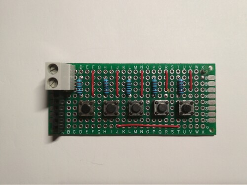

# Save your Bonsai with Arduino

### Based on a real adventure that got me angry, disappointed, excited, and happy (all together)

## My Bonsai died.

So this is the real thing: I had no time. Sometimes you forget to water your bonsai and you end up with no more than a stick in the dirt. Not much of a deal.

## But wait… I’m a Programmer!

I realized that as a programmer, I’m created for building overcomplicated things to achieve simple results just for the sake of it. So what better opportunity to build an irrigation system for keeping my plants happy?

## The solution: Drip Irrigation

According to the Montreal Botanical Garden, drip irrigation is one of the best watering methods for optimum use of water; since drip irrigation releases water only to specific places, it uses much less water than sprinklers.

“Water is released slowly, without settling the soil. Water losses through evaporation are limited and plants foliage does not get wet, which reduces the risk of fungal diseases.”

– Montreal Botanical Garden

## The Hardware

It should be enough an Arduino Uno but other solutions can be applied here:

* Arduino Mega if you want to add some more sensors or motors

* Raspberry Pi if you want it to communicate with some sort of service over the internet.

Some of the hardware parts used in this project are:

* Arduino Uno

* Breadboard + Jumper Wires

* Nema 17 Stepper Motor (as a peristaltic pump)

* DRV8825 Stepper driver

* 16x2 LCD

* 5 Push buttons

* Capacitor 100uF

The connection scheme is:

### **Stepper Motor as a Peristaltic Pump**

The need to use such a power inefficient motor like a Nema 17 is the ability to keep and mantain precision in movements.

A peristaltic pump works in a way that is ensured that every time you use the pump, the water flow will remain the same.

There are a lot of motors that could be used in a peristaltic pump (there are other alternatives using DC motors) but a stepper motor is one of the few that will ensure a constant water flow over time, plus it is easy to modify if you calculate the water flow per step.

### **Push buttons**

The five push buttons are for controlling the pump, the controls are:

* Fast Backward

* Backward

* Stop

* Forward

* Fast Forward

I first tried with a resistive multiplexer in order to use a single analog input to read 5 push buttons at once, but I ended up using a classic approach with digital inputs just because I did not had around the right resistors to give me a good reading gap value to distinguish which button was pressed exactly.

Here is a [link](https://electronics.stackexchange.com/questions/101409/how-to-debouce-six-buttons-on-one-analog-pin-with-arduino) if you want to know how a resistive multiplexer works ;)

### **DRV8825**

The driver has a maximum output capacity of 45 V and ± 2 A which is great for driving small to medium-sized stepper motors like a NEMA 17 bipolar stepper motor.

Stepper motors typically have a step size of 1.8° or 200 steps per revolution, this refers to full steps. A microstepping driver such as the DRV8825 allows higher resolutions by allowing intermediate step locations. This is achieved by energizing the coils with intermediate current levels.

The resolution (step size) selector pins (M0, M1, and M2) allow you to select one of the six step resolutions according to the table below.

|M0  |M1  |M2  |Microstep res.|
|----|----|----|--------------|
|Low |Low |Low |Full step     |
|High|Low |Low |1/2  step     |
|Low |High|Low |1/4  step     |
|High|High|Low |1/8  step     |
|Low |Low |High|1/16 step     |
|High|Low |High|1/32 step     |
|Low |High|High|1/32 step     |
|High|High|High|1/32 step     |

All three inputs have internal 100 kΩ pull-down resistors, so leaving the three microstep selection pins disconnected results in full-step mode.

I have left M0, M1 and M3 disconnected, so the driver operates in full-step mode.

The DRV8825 carrier board uses low-ESR ceramic capacitors, which makes it susceptible to destructive LC voltage spikes, especially when using power leads longer than a few inches.
To protect the driver you can connect an electrolytic capacitor between VMOT and GND. Pololu suggests a capacitor of 47µF or more (I used a 100 µF capacitor).

### **How to set the current limit?**

Before you start programming your Arduino and start using the driver there is one very important thing you need to do that a lot of people forget: set the current limit!

This step is not very complicated but absolutely necessary to protect your stepper motor and the driver. If you do not set an appropriate current limit, your motor can draw more current than it or your driver can handle, this is likely to damage one or both of them.

To set the current limit you need to measure a reference voltage and adjust the on-board potentiometer accordingly. You will need a small screwdriver, a multimeter to measure the reference voltage, and alligator test leads (optional but very handy).

To measure the reference voltage, the driver needs to be powered. The DRV8825 only needs power via VMOT (8.2–45 V) and you need to apply 5 V to RST and SLP otherwise, the driver won’t turn on. It’s best to disconnect the stepper motor while you do this.

If you have already wired up the driver as I have shown before, you can leave the Arduino connected to power the RST and SLP pins.

|DRV8825|Connection  |
|-------|------------|
|VMOT   |8.2–45 V    |
|GND    |Motor ground|
|SLP    |5V          |
|RST    |5V          |
|GND    |Logic ground|

### **Current limit formula**

The next step is to calculate the current limit with the following formula:

**Current Limit = Vref × 2**

So this means that for a current limit of 1 A the Vref should be 0.5 V.

Now you will need to measure the reference voltage (Vref) between the two points marked on the picture below (GND and the potentiometer) and adjust it to the value you calculated.

## The Software

The Arduino script is very light and easy to understand, I have [uploaded it on github](https://github.com/GiacintoCarlucci/arduino-peristaltic-pump) if you want to take a look.

The code uses [AccelStepper](http://www.airspayce.com/mikem/arduino/AccelStepper/index.html) library, a useful and well documented set of functions to control your stepper motor.

## Calculating Water Flow

Since this is a calculation that involves tubing sizes I decided to measure the time it took to fill a graduated container, using some simple math:

**Running the stepper motor at 100 steps per second:**

- 10ml in 1:50min
- 20ml in 3:40min
- 30ml in 5:30min
- 40ml in 7:20min
- 50ml in 9:10min

1ml every (110/10) = 11 sec at 100steps
1ml/11sec = 0.090909091 ml each second
0.090909091/100steps = 0.000909091 x step

**At 1 step per second:**

- 0.000909091 ml per second
- 0.05454546 ml per second
- 3.2727276 ml per hour
- 78.5454624 ml per day

**So this bring to us:**

- At 2 step per sec: 157ml/day
- At 3 step per sec: 235ml/day
- At 4 step per sec: 314ml/day
- At 5 step per sec: 392ml/day

So now I can take these timings into considerations if I want to set the pump flow.

## A Jumpers Nest

After testing that everything was going well and smoothly, I decided to solder some boards to reduce the amount of jumper wires on the breadboard.

Here you are some basic schemes with final results:

**Push button control panel**

scheme:

final result:

**Stepper Driver**

scheme:

final result:

## I’m an Idiot

I was so excited to try the new boards that I mounted the DRV8825 upside down and well… this thing fried the chip.

Not a big issue by the way, the DRV8825 is quite cheap and I needed a bunch of them, so I ordered some more and waited for the delivery.

Once arrived, I mounted the chip on the board and… the motor was spinning slowly and missing steps.

The most common issue can be a misconfiguration in the Vref trimmer on the driver, but again, after a quick check, the motor was still missing steps and acting strange.

I studied more on the argument and nothing was helping me, but while observing the motor in its strange and SLOW movements I finally figured out: it was using microstepping.

The thing is that I did not set the driver to operate in microstepping, this made me think that there was an issue with the board I soldered. In fact, while checking the connections, I found out that some of the pins were shorting… maybe the solder melted the plastic and caused the issue, so I designed and soldered an improved version, since I didn’t like the arrangement of the motor connector.

new scheme:

new board:

## The Results

After creating my new board being careful to not melt plastic or mess any connections, everything worked fine, the timings remained the same for ml/min flow and the motor was not overheating. The driver was not hot but a little fan on top of it could help.

<iframe width="560" height="315" src="https://www.youtube.com/embed/g-EnY6lvtkY" frameborder="0" allowfullscreen></iframe>

The whole project could be mounted in an enclosure to keep everything tidy and organized

## Future Improvements

Of course this is just a proof of concept but a lot of improvements could be added here:

* Do not irrigate if soil is wet

* Detect if water reservoir is empty

* Solar powered system

* Water based on time

* Bluetooth control

* Irrigate less or more reading ambient temperature

* Data logging

### Bonus Idea

Teach an Artificial Intelligence using sensors while watering the plant by hand under different conditions, so you can extract a model that can decide when to water and how much.

## Resources

* [How to control a stepper motor with DRV8825 driver and Arduino](https://www.makerguides.com/drv8825-stepper-motor-driver-arduino-tutorial/)

* [Arduino Forum](https://forum.arduino.cc/)

* [How a peristaltic pump works](https://en.wikipedia.org/wiki/Peristaltic_pump?oldformat=true)
