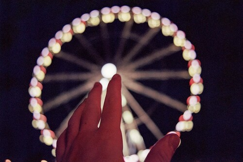
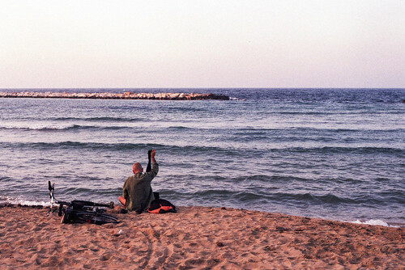
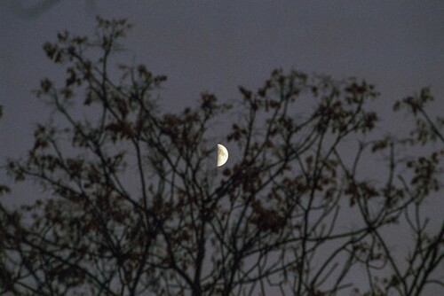
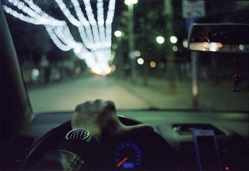
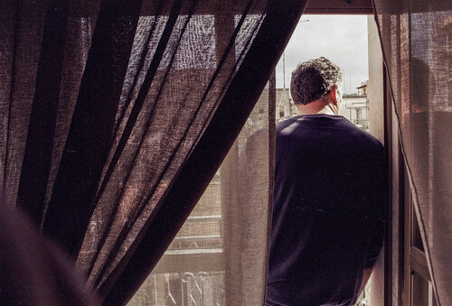
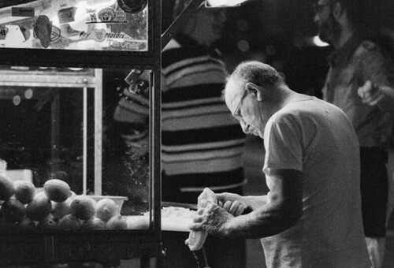
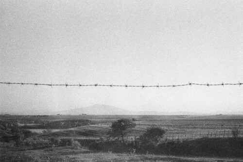
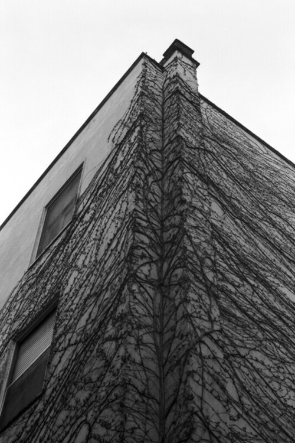

# Photography

I always liked taking photos, but my journey with analog photography
started with a friend of mine, Francesco, that found an old analog
camera (a Pentax Spotmatic F) in his grandparent's basement.

He showed me the camera and tried to take some pics with analog film,
it seemed like magic to me, and I absolutely wanted to explore this
world, so I bought an analog camera as well (Yashica Fx3-Super 2000)
from an old photographer in Rome and started taking some pictures.

At the beginning it was a bit frustrating, with analog photography you
lose  all the automatic focus and exposure features, so many pictures
were too dark, too light, out of focus or blurry... meh.

But still, I could feel something different... the feeling of impatience
and curiosity when you want to know how a picture will turn out was something
new to me. You know, with smartphones and digital cameras we usually see
the results as soon as we take the picture, but with analog cameras you
have to wait: you need to finish the entire film roll before developing it
and scan or print your frames.

The way we take pictures today is istantaneous, we have a virtually
unlimited number of retries if you don't like the picture you just made.
On the other hand, with film you have only 24 or 36 frames and it will cost you money:
A film roll can cost 5 to 20 dollars (it depends on wich type of roll you buy),
so you are forced to think, consider and analize a shot before pushing the button
on your camera, this will eventually bring you to take photos only for
the moments, places and people you really enjoy being in/at/with.

If you fall in love with this mindset, you will never turn back to digital again.

Plus, analog cameras **works without batteries**! It's just a bunch of springs
and gears, so you can take pictures without worrying about it :)

Finally, with digital cameras you need to consider external SD's, dedicated HDD
to sore your photos and **backups**. If your HDD fails... well... you guessed it.
The analog approach works in a way that if you lose your digital scans you always
have your prints, and if you lose your prints you always have your negatives.

I started uploading my pictures on [Flickr](https://www.flickr.com/photos/145631298@N08/) 
but later i began adding them to my [Instagram](https://www.instagram.com/giacintocarlucci/)
also, feel free to take a look!

## My gears

### Cameras:

* Yashica FX3-Super 2000

### Lenses:

* Yashica ML 28mm f2.8
* Carl Zeiss Planar 50mm f1.7
* Yashica ML Zoom 80-200mm f4

## Shooted Films

* Kodak Ektachrome 100 ISO
* Kodak Ektar 100 ISO
* Kodak Gold 100 ISO
* Kodak 160 NC 160 ISO
* Kodak Color 200 ISO
* Kodak Gold 200 ISO
* Kodak Ultramax 400 ISO
* Fujifilm Superia Xtra 400 ISO
* Kodak TMax 400 ISO
* IlFord PANF+ 50 ISO
* IlFord FP4+ 125 ISO
* IlFord HP5+ 400 ISO
* IlFord Delta 3200 ISO

Here you are some of my favourite pics:

